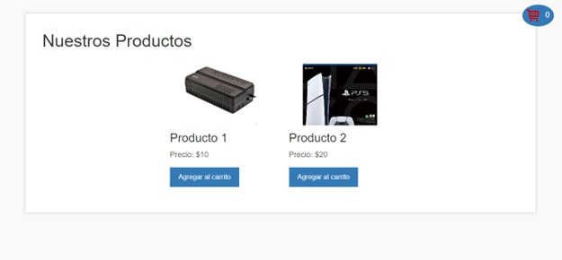
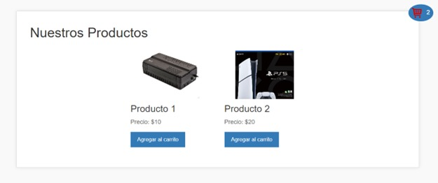
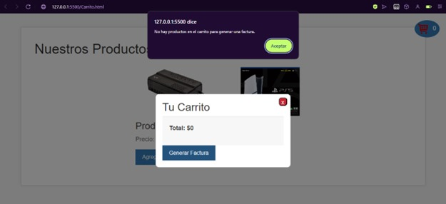

**Diseño y Programación de Software Multiplataforma DPS941 G01T**

Ing. Alexander Alberto Siguenza Campos

**Trabajo de Investigación**

Integrantes: 

| Nombre | Carnet |
| :---: | :---: |
| Ludwin Enrique Martínez Alfaro | MA222763 |
| Carlos Adalberto Campos Hernández | CH222748 |
| Irvin Eduardo González Romero | GR202825 |
| Rafael Ernesto Flores Canizales | FC202823 |
| José Alexander Cruz Alvarado | CA202818 |

**Principal**

Acá se muestra la página principal donde están alojados los productos, con su precio y su botón para poder ser agregado al carrito, además del icono donde veremos mas adelante los productos seleccionados, con su cantidad.

Ahora se hizo una selección de dos productos, entonces con la función hacemos se irán sumando cada que agreguemos al carrito.

**Carrito de compras** 

Por defecto no nos aparecerá ningún producto seleccionado.

Al agregar los dos productos, saldría de la siguiente manera  
Donde se observa, el nombre del producto, con la imagen y cuantos de esos productos se ha llevado y su precio, además de 3 botones, el \- es para quitar producto, el \+ es para agregar otro del mismo, y la x seria para quitarlo del carrito de compras.

Además se muestra el total y el Generar factura que lo veremos más adelante.

Al darle en el botón \+, se agregó otro producto en ambas selecciones, y cambia lo que seria el total y cuantos de esos productos se lleva.

Al darle en el – revertirá al estado anterior

Al darle en la equis se quita todo el producto del carrito de compras, aunque se haya multiplicado dos veces para llevar.

**Generación de Factura**

Acá se muestra al presionar en generar factura, un PDF, en una tabla con lo que se ha pedido con su nombre, precio, la cantidad y el total de la compra, con su respectiva Impuesto IVA.

Y botón para regresar a la pagina principal y seguir comprando. 

 

**Validación** 

Acá se muestra respectivamente validado, que al no tener ningún producto en el carrito de compras no nos permitirá generar una factura

